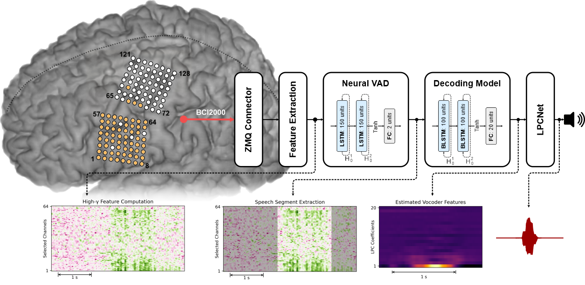

# Delayed Speech Synthesis

Repository accompanying the study **Online speech synthesis using a chronically implanted brain-computer interface in an individual with ALS** by Angrick et al. [1] containing scripts to train and run the speech synthesizer. 
This Brain-Computer Interface (BCI) enabled an individual living with ALS to produce audible speech based on invasive neural signals. 
The manuscript of the study can be found [here](https://www.nature.com/articles/s41598-024-60277-2).

## Data
Electrocorticographic (ECoG) signals were acquired from speech-related areas including motor, premotor and somatosensory cortices. 
For this project, we conducted experiment recordings in which the study participant reads aloud single words prompted on a screen in front of him. 
Here, the words were drawn from a fixed vocabulary of 6 keywords. Simultaneously, we acquired spoken speech via a microphone. 
All data for this study can be found [here](http://www.osf.io/49rt7/). 
Neural data is stored in .mat files with similar structures to the BCI2000 .dat file format. 
Additionally, time-aligned high-quality audio (16 kHz) can be found in the .wav file. 
The .lab files contain the respective timings when the stimuli were presented to the patient and were inferred from the states array of BCI2000. 
Last, Microsoft Excel files contain the statistics to compute the confidence intervals used to identify which channels carry the most speech information. 
These statistics have only been computed on the training data. 

The data repository contains data for training the system and the sessions in which the patient used it. 
Furthermore, it contains the syllable repetition data used to compute baseline statistics. 

## Installation

We used the Python programming language (version 3.10) for both the real-time system and all analysis scripts (except for the contamination analysis, which is based on the matlab package provided by Roussel et al. [2], which can be found [here](https://zenodo.org/records/3929297)). 
All dependencies (except PyTorch and ezmsg) can be found in the [requirements.txt](requirements.txt) file. 
Additionally, our approach incorporates the [LPCNet vocoder](https://github.com/xiph/LPCNet) which is embedded into this repository as a submodule. We used the ezmsg framework in version 3.0.0.

Fetch all necessary files for LPCNet using the following two commands:
```bash
git submodule init
git submodule update  # Pull LPCNet .c source files from the official repository into extensions/lpcnet/LPCNet
```

Some components, such as the LPCNet wrapper, are written in Cython and need to be compiled. These components are provided as extensions and can be installed using the following commands:

```bash
pip install extensions/lpcnet  # Will need autoconf and libtool installed
pip install extensions/hga
```

**Note** that LPCNet was developed for linux based operating systems and may not compile under windows operating 
systems. For outputting audio, we use the SoX.

With respect to ezmsg, use the following commands to install based on a local copy:
```bash
pip install /path/to/ezmsg-3.0.0
pip install /path/to/ezmsg-3.0.0/extensions/ezmsg-sigproc
pip install /path/to/ezmsg-3.0.0/extensions/ezmsg-websocket
pip install /path/to/ezmsg-3.0.0/extensions/ezmsg-eeg
```

## Online Speech Synthesis Approach

An illustration and a brief description about our BCI approach is given below. For more information see the matierials and methods section in our published manuscript. 



Neural signals were sent with BCI2000 and ZeroMQ over a local network to a streaming application. 
This streaming application selects relevant channels and computes high-gamma activity frames (50 ms windows with a 10 ms frameshift). 
Such high-gamma features have previously shown to contain information about speech and language processes.
Each of those frames gets normalized (z-score normalization) with respect to day specific statistics calculated on a dedicated SyllableRepetition task.
Next, we identify segments of spoken speech purely from the cognitive processes encoded in the high-gamma features. 
Once speech is detected, we buffer all proceeding frames until the neural voice activity detection model predicts that speech production has finished.
Neural activity from identified speech segments is then propagated to a bidirectional decoding model which recovers acoustic features that can be synthesized with LPCNet and played back on the loudspeaker.  

## Replicating the Processing Pipeline 
We provide a [bash script](replicate.sh) to easily replicate our processing pipeline. 
The script is divided into multiple stages. 
Use stage and end_stage to control which steps to run. 
This repository contains scripts for training models (neural VAD and the decoding model), computing baseline statistics from offline data, the online decoder and a development amplifier which can be used to stream data locally and debug real-time decoding.

### Configuration Files 

We used .ini files to facilitate running the online decoding on our inference machine. A template of the configuration script can be found [here](config/debug_settings.ini). It needs to be adjusted to match the correct paths for the data before running the replication stages.  

### Development Amplifier 

This repository comes also with a development amplifier which can stream the neural signals directly from a recorded .mat file. Although our results were based on an actual amplifier during online decoding, the development amplifier can be used to replicate the online streaming in a local network. The bash script is setup to first start the development amplifier in the background and run for 60 seconds. Simultaneously, the online decoder starts and runs until gracefully shut-down with Ctrl-C. Note that the results might slightly differ as all model trainings might converge to different weights.

## References
- [1] Angrick, M., Luo, S., Rabbani, Q. et al. Online speech synthesis using a chronically implanted brain–computer interface in an individual with ALS. Sci Rep 14, 9617 (2024).
- [2] Roussel, P., Le Godais, G., Bocquelet, F. et al. Observation and assessment of acoustic contamination of electrophysiological brain signals during speech production and sound perception. Journal of Neural Engineering, 17(5), 056028 (2020).